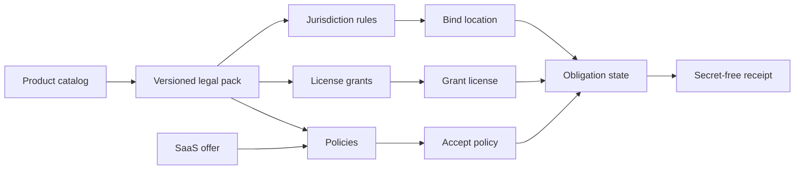
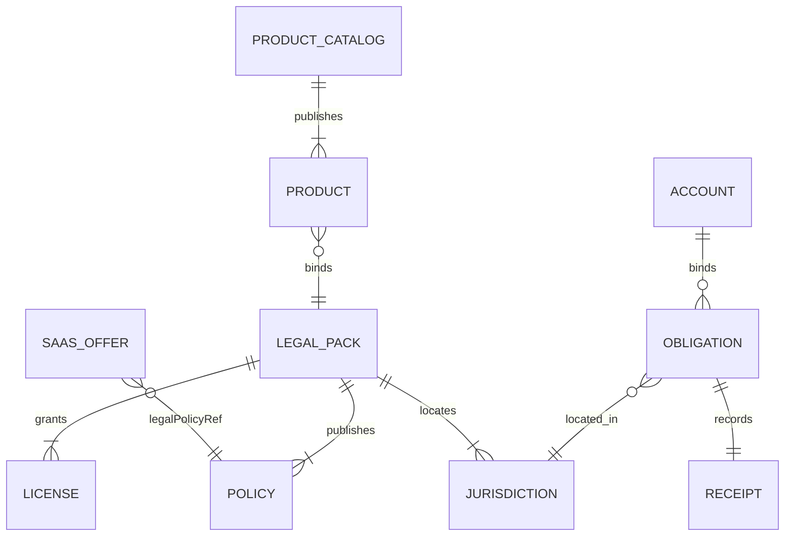

# Legal Lifecycle architecture

## Scope and standard composition

The legal lifecycle standard describes versioned licenses, policies and
jurisdiction rules. It does not give legal advice, store personal data,
process payments or deploy products.

- `wellmanifest/dsl` constrains legal requests;
- POA compiles requests into exact plans, grants and receipts;
- `wellmanifest/product-lifecycle` owns product identity and stage;
- `wellmanifest/saas-lifecycle` owns commercial offers and may bind
  `legalPolicyRef` / pack references from this module;
- courts, regulators and counsel remain external authorities.

## Normative invariants

1. Every published pack MUST be versioned and name at least one product,
   license, policy and jurisdiction.
2. A jurisdiction uses ISO 3166 country codes. Subdivision codes, when
   present, MUST belong to that country. Personal names, postal addresses
   and emails are forbidden.
3. `eu` and `eea` jurisdictions MUST require explicit consent and at least
   14 consumer-withdrawal days. Missing conversion or consent semantics
   fail closed.
4. The default jurisdiction MUST exist in the pack and MUST NOT be
   `prohibited` for product or service availability.
5. A pack that offers no `offered` product jurisdiction is invalid.
6. Copyleft `strong` or `network` MUST declare source disclosure other than
   `none`.
7. `policy://.../vN` references are the same family used by
   `saas-lifecycle` `legalPolicyRef`. Changing terms requires a new version.
8. `check_availability` MUST NOT carry a policy or license grant.
9. `accepted` obligation state MUST list at least one accepted policy.
   `unbound` MUST NOT list grants.
10. Receipts MUST set `secretsRedacted=true` and `personalDataStored=false`.
    Documents are not legal advice and are not execution authority.

## Trust boundaries

| Boundary | Owns | Must reject |
| --- | --- | --- |
| Legal pack registry | Versioned jurisdictions, licenses, policies | Unversioned terms, implied consent, legal prose dumps |
| Product catalog | Product identity and stage | Embedding license text or prices |
| SaaS offer | Commercial plans and `legalPolicyRef` | Defining tax/legal semantics inline |
| Identity service | Account membership | Inferring jurisdiction from email |
| Obligation store | Bound location, accepted policies, grants | Personal data, attorney work product |
| Receipt store | Redacted outcome hashes | Advice, filings, credentials |

## Composition with SaaS and product catalogs

A later `saas-lifecycle` offer continues to own settlement and trial
conversion. This module answers only: which license, which policy version,
and whether the product or service may be offered in a named location.
