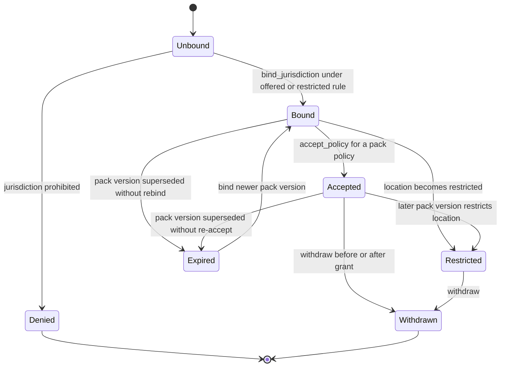
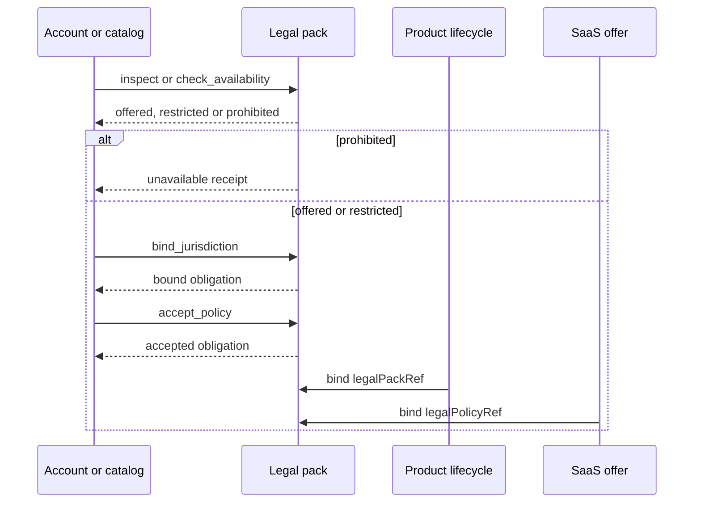

# Legal Lifecycle logic flow

## Bind, accept and withdraw

`check_availability` never changes obligation state. It is a read of the
named pack and jurisdiction.

## Location and license checks

A SaaS signup may start only after the selected plan's `legalPolicyRef`
resolves to a pack policy that is accepted for the bound jurisdiction.

## Failure routing

| Failure | Required state/outcome | Safe next action |
| --- | --- | --- |
| EU pack with fewer than 14 withdrawal days | `denied` | publish a new pack version |
| Default jurisdiction prohibited | `denied` | choose an offered default |
| `accept_policy` without `policyRef` | `denied` | include a pack policy ref |
| `check_availability` with a license grant | `denied` | inspect only |
| Personal email or address in a request | `denied` | use opaque account and location refs |
| Inline legal advice or court filing | `denied` | keep counsel artifacts in a governed store |
| `accepted` without policies | `failed` | require acceptance evidence |
| Receipt with personal data | `failed` | redact and re-issue |

No failure path stores personal data or turns a transport-level success into
an accepted obligation.
